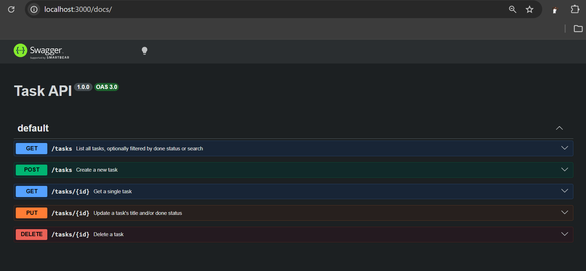
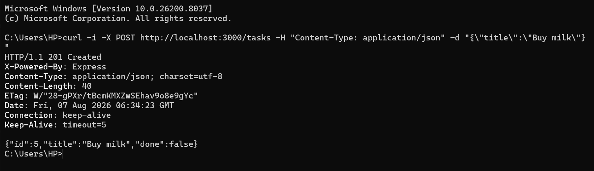
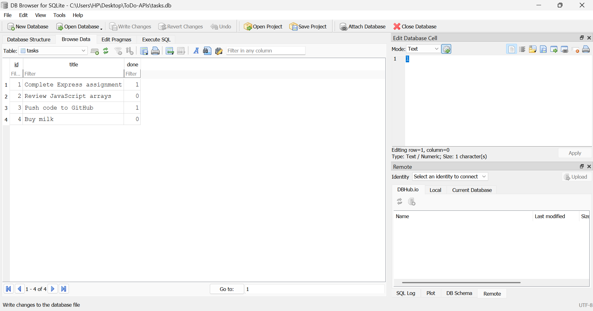
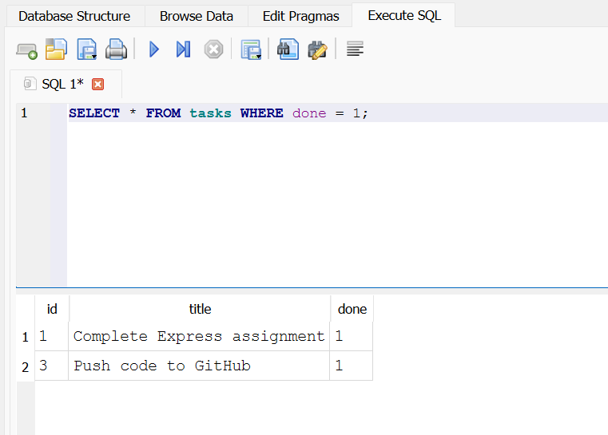

# Task API

A small backend API to manage a to-do list. You can create tasks, read them, update them, and delete them (CRUD). Data is stored in a SQLite database, so it survives server restarts.

## How to install and run

Requirements: Node.js (tested on v24.13.0)

```
git clone https://github.com/meerabc/Todo_CRUD_APIs.git
cd Todo_CRUD_APIs
npm install
node index.js
```

The server will start on `http://localhost:3000`. The database file and table are created automatically on first run, and 3 example tasks are added if the table is empty.

## Project structure

The code is organized in layers:
- `src/routes/` : handles HTTP requests and responses, no business logic
- `src/services/` : validation and business rules
- `src/repositories/` : the only place that talks to the database (SQL)
- `src/middleware/error-handler.js` : turns thrown errors into HTTP status codes

This separation means the database can be swapped out later without changing the routes or the validation rules, only the repository file would need to change.

## Why SQLite

I used SQLite because it doesn't need a separate database server, it just runs as a single file (`tasks.db`) inside the project folder. This is a good fit for a small project like this API. Since it's file based, my task data now survives a server restart, unlike Assignment 1 where everything was stored in a JavaScript array in memory and disappeared every time the server restarted.

## Database file

The database is stored in a file called `tasks.db` in the root of the project. This file is created automatically the first time the server runs. It is not committed to GitHub (it's listed in `.gitignore`), since it gets generated on its own and shouldn't be tracked like source code.

## Endpoints

| Method | Path         | Description                          |
|--------|--------------|---------------------------------------|
| GET    | /            | Basic info about this API             |
| GET    | /health      | Check if the server is running        |
| GET    | /tasks       | List all tasks (supports optional filters, see below) |
| GET    | /tasks/:id   | Get a single task by id               |
| POST   | /tasks       | Create a new task                     |
| PUT    | /tasks/:id   | Update a task's title and/or done     |
| DELETE | /tasks/:id   | Delete a task                         |

## Extras (optional, beyond the required endpoints)

| Method | Path                  | Description                                  |
|--------|-----------------------|-----------------------------------------------|
| GET    | /tasks?done=true       | Only tasks that are marked done               |
| GET    | /tasks?done=false      | Only tasks that are not done                  |
| GET    | /tasks?search=milk     | Only tasks whose title contains "milk"        |
| GET    | /stats                | Task counts: total, done, open                |
| POST   | /reset                | Restore the original 3 example tasks          |

## Swagger UI

Once the server is running, open `http://localhost:3000/docs` in your browser to see and test all the `/tasks` endpoints interactively.



## Example request

Creating a new task with curl:

```
curl -i -X POST http://localhost:3000/tasks -H "Content-Type: application/json" -d "{\"title\":\"Buy milk\"}"
```



## Database viewer

I used DB Browser for SQLite to look at `tasks.db` directly.



## Example SQL query

One query I ran directly in DB Browser:

```sql
SELECT * FROM tasks WHERE done = 1;
```



This returns only the tasks that are marked as done. After running this and other queries (like `UPDATE` and `DELETE`) directly on the database, I called `GET /tasks` through my API and saw the exact same changes reflected. This showed me that my API is just reading and writing to this same file, it has no separate copy of the data anywhere.